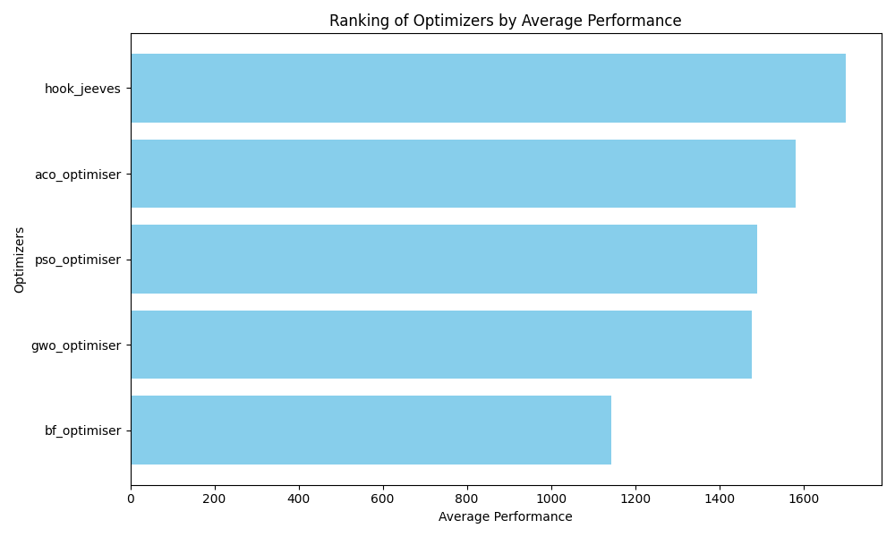
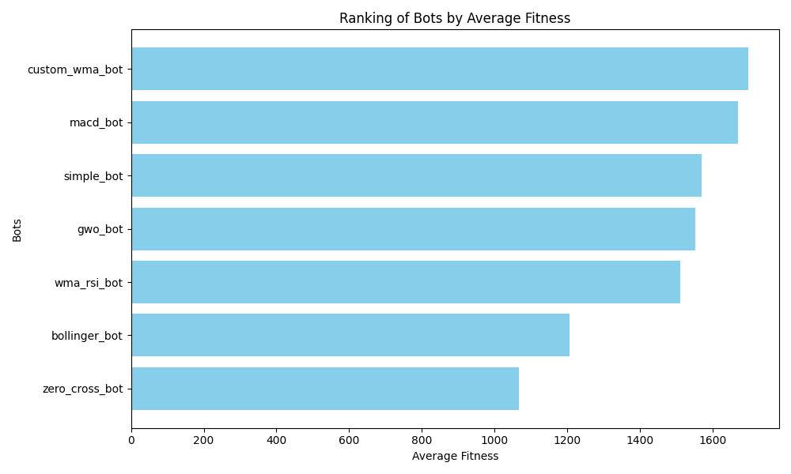

# CITS4404-Project

## Trading Bots and Optimisation Algorithms

1. **Dataset**: [BTC/USD Dataset](https://www.kaggle.com/datasets/prasoonkottarathil/btcinusd)

Dependencies may be required to run the simulation. To install the required dependencies, run the following:
```
pip install -r requirements.txt
```

To reproduce the results described in the report/video, first download the source code. 

To view the results of the original bot/optimizer pairs with own chosen training datasets, run the following:
```
python bots_tester.py
```

To get the plots of the average performance of bots and optimizers when seeded with np.random.seed(4404), with the maximal daily training dataset of 2014-2019, run the following:
```
python test_all.py
```
To get the results from using a "rocky" training data set, edit config described at the bottom of the test_all.py file with the "rocky" dataset (2015-01-01 to 2015-10-31).



To get the plot of convergences of fitness of the training dataset, run the following:
```
python FitHistory.py
```


To get the plots of MACD bot with ACO optimized parameters and default [12, 26, 9], run the following:
```
python test_macd_bot.py
```


